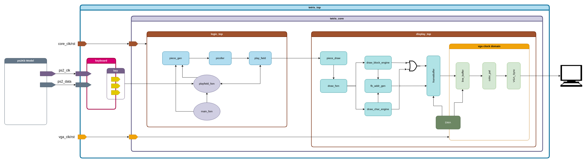

# SpinalTetris
This project implements the classic Tetris game using pure digital logic without any microcontroller (MCU), written entirely in SpinalHDL and designed to run on a Xilinx FPGA board.  The goal of this project is for education only

