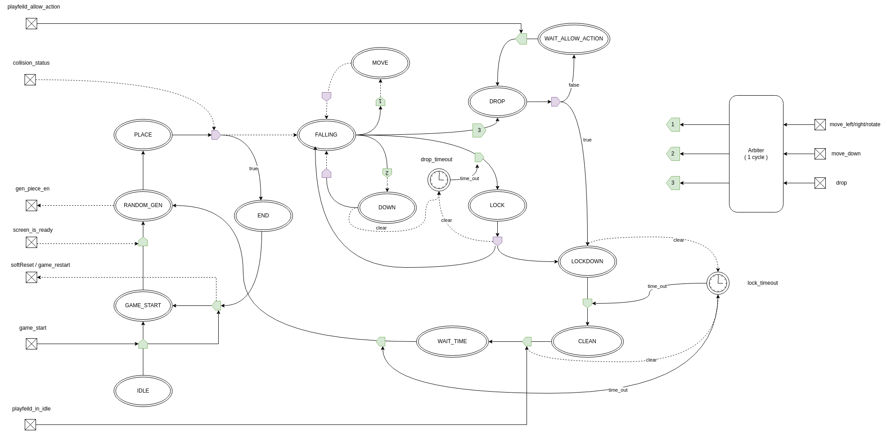

# Controller IP Specification

## 1. Purpose and scope

`controller` is the gameplay control FSM for the Tetris pipeline. It sequences piece spawn, user motion requests, automatic falling, lock timing, and restart handling.

This document is written for SoC/IP integration teams. It describes the externally visible behavior of the IP, the meaning of each interface signal, and the timing/handshake expectations needed to connect the controller to the piece generator, collision/playfield engine, and display pipeline.

## 2. Functional role inside the subsystem

At a system level, the controller sits between:

- the game input source (`game_start`, move keys, rotate, drop),
- the playfield/collision engine (`collision_status`, `playfield_allow_action`, `playfield_in_idle`), and
- the piece generation path (`gen_piece_en`).

Its responsibilities are:

1. wait for the screen path to become ready,
2. request a new piece,
3. validate whether the new piece can be placed,
4. arbitrate one user motion request at a time,
5. perform automatic falling after a programmable timeout,
6. perform hard-drop stepping until collision,
7. start lock-down timing after bottom collision,
8. issue a lock pulse when the piece must be committed,
9. wait until the playfield reports idle, then request the next piece,
10. handle game-over restart.

## 3. Configuration parameters

`ControllerConfig` defines the synthesized behavior.

| Parameter | Type | Meaning |
| --- | --- | --- |
| `rowNum` | `Int` | Total playfield row count, including boundary rows. |
| `colNum` | `Int` | Total playfield column count, including side walls. |
| `levelFallInCycle` | `Int` | Number of clock cycles before an automatic downward step is requested. Default: `473 * 50000`. |
| `lockDownInCycle` | `Int` | Number of clock cycles used both for lock-down delay and post-clean wait delay. Default: `500 * 50000`. |

Derived values are computed for sizing only:

- `rowBitsWidth = log2Up(rowNum)`
- `colBitsWidth = log2Up(colNum)`
- `rowBlocksNum = rowNum - 1`
- `colBlocksNum = colNum - 2`

### Timing note

The comments in the source assume a `50 MHz` clock. Therefore the default values correspond approximately to:

- automatic fall delay: ~`473 ms`
- lock-down / post-clean delay: ~`500 ms`

For a different controller clock frequency, these durations scale proportionally.

### Debug build behavior

When the elaboration profile enables `DebugSignals`, the internal timeout values are shortened for simulation convenience:

- fall timeout is limited to `10000` cycles,
- lock timeout is limited to `100` cycles.

This affects debug/test elaboration only and should not be used as the integration timing reference for release RTL.

## 4. Top-level interface

### 4.1 Inputs

| Signal | Type | Meaning |
| --- | --- | --- |
| `game_start` | `Bool` | Starts the game from `IDLE`; also restarts from `END`. |
| `move_left` | `Bool` | User request to move current piece left. Rising-edge captured. |
| `move_right` | `Bool` | User request to move current piece right. Rising-edge captured. |
| `move_down` | `Bool` | User request to soft-drop by one row. Rising-edge captured. |
| `rotate` | `Bool` | User request to rotate current piece. Rising-edge captured. |
| `drop` | `Bool` | User request to hard-drop. Rising-edge captured. |
| `screen_is_ready` | `Bool` | Indicates that the display side is initialized and gameplay may start. |
| `playfield_in_idle` | `Bool` | Indicates that the playfield has finished its lock/clean/update work. |
| `playfield_allow_action` | `Bool` | Indicates that the playfield can accept an action request in the current cycle. |
| `collision_status.valid` | `Bool` | Completion strobe from the collision/playfield engine. |
| `collision_status.payload` | `Bool` | Collision result associated with the current check. `true` means collision; `false` means no collision. |

### 4.2 Outputs

| Signal | Type | Meaning |
| --- | --- | --- |
| `game_restart` | `Bool` | Pulse requesting a full game restart after game-over. |
| `softReset` | `Bool` | Pulse used to reset external gameplay state on restart. |
| `gen_piece_en` | `Bool` | Pulse requesting generation/spawn of the next piece. |
| `move_out.left` | `Bool` | Pulse requesting one left move attempt. |
| `move_out.right` | `Bool` | Pulse requesting one right move attempt. |
| `move_out.rotate` | `Bool` | Pulse requesting one rotation attempt. |
| `move_out.down` | `Bool` | Pulse requesting one downward move attempt. Used by soft drop, hard drop, and automatic fall. |
| `lock` | `Bool` | Pulse indicating that the current piece must be locked into the field. |

### 4.3 Optional debug outputs

When `DebugSignals` are enabled:

| Signal | Meaning |
| --- | --- |
| `debug.debug_place_new` | Toggle-style pulse derived from an internal counter after a new piece placement attempt. |
| `debug.controller_in_lockdown` | High while the FSM is in `LOCKDOWN`. |
| `debug.controller_in_end` | High while the FSM is in `END`. |
| `debug.controller_in_place` | High while the FSM is in `PLACE`. |

## 5. Interface contract and handshake semantics

### 5.1 Motion inputs are edge-captured

The five motion inputs are sampled on their rising edge and stored in an internal request register:

- `drop`
- `move_down`
- `move_left`
- `move_right`
- `rotate`

Because requests are latched, a one-cycle input pulse is sufficient.

A request remains pending until one of the following happens:

- the controller leaves `FALLING` to serve the request,
- `game_start` is asserted,
- `game_restart` is asserted.

This means a user request can be issued while `playfield_allow_action` is low; the request is held and replayed when the playfield later becomes available.

### 5.2 Collision status is a completion response

`collision_status` is a `Flow(Bool)` input. The controller does not provide a `ready` signal. The connected block must therefore:

1. observe the current controller request/state,
2. perform the requested move/place check,
3. pulse `collision_status.valid` when the result is available,
4. drive `collision_status.payload = true` for collision / illegal placement, or `false` for success.

The payload is consumed differently depending on state:

- `PLACE`: payload determines spawn success or game-over,
- `DOWN`: payload determines whether the piece moved down successfully,
- `DROP`: payload determines whether hard-drop reached bottom,
- `LOCK`: payload determines whether auto-fall hit bottom,
- `MOVE`: only `valid` is used by the controller; payload is ignored.

### Important integration note for lateral move / rotate

During `MOVE`, the controller only waits for `collision_status.valid` and then returns to `FALLING`. It does **not** branch on `collision_status.payload`.

Therefore the playfield/collision engine must fully own the accept/reject behavior for left/right/rotate requests. In other words, if a lateral move or rotation is illegal, the downstream block must suppress the actual state update internally and still return a completion pulse.

### 5.3 `playfield_allow_action` gates request issue, not request capture

`playfield_allow_action` does not prevent user inputs from being latched. It only prevents the controller from issuing the action pulse immediately.

Practical effect:

- user pulse arrives while `playfield_allow_action = 0` -> request is stored,
- once `playfield_allow_action = 1`, the controller emits the corresponding `move_out` pulse.

### 5.4 `playfield_in_idle` closes the lock/clean sequence

After `lock` is asserted, the controller enters a cleanup phase and waits for `playfield_in_idle = 1` before starting the post-clean wait interval and generating the next piece.

The connected playfield logic must raise `playfield_in_idle` only after all memory/frame-buffer/line-clear side effects are complete.

## 6. FSM definition

The controller is implemented as a single state machine.

### 6.1 FSM architecture image

### 6.2 State summary

| State | Main purpose | Exit condition |
| --- | --- | --- |
| `IDLE` | Wait for game start. | `game_start = 1` |
| `GAME_START` | Wait for display pipeline readiness. | `screen_is_ready = 1` |
| `RANDOM_GEN` | Request a new piece. | Immediate transition to `PLACE` |
| `PLACE` | Validate spawn position of the new piece. | `collision_status.valid = 1` |
| `END` | Hold game-over state. | `game_start = 1` |
| `FALLING` | Main gameplay state; accept/gate motions and automatic fall timeout. | motion request served or fall timeout expires |
| `DOWN` | Process one soft-drop step. | `collision_status.valid = 1` |
| `DROP` | Process one hard-drop downward step. | `collision_status.valid = 1` |
| `WAIT_ALLOW_ACTION` | Wait for playfield availability between hard-drop steps. | `playfield_allow_action = 1` |
| `MOVE` | Wait for completion of left/right/rotate request. | `collision_status.valid = 1` |
| `LOCK` | Perform automatic fall downward check after timeout. | `collision_status.valid = 1` |
| `LOCKDOWN` | Hold the piece for lock-down delay. | `lock_timeout` expires |
| `CLEAN` | Wait for playfield cleanup to complete. | `playfield_in_idle = 1` |
| `WAIT_TIME` | Add post-clean dead time before next spawn. | `lock_timeout` expires |

### 6.3 Detailed state behavior

#### `IDLE`

- All command outputs are deasserted.
- Transition to `GAME_START` occurs when `game_start` is asserted.

#### `GAME_START`

- Waits until `screen_is_ready` is asserted.
- This allows the display subsystem to be initialized before gameplay begins.

#### `RANDOM_GEN`

- Asserts `gen_piece_en`.
- Immediately transitions to `PLACE`.
- Integration expectation: the piece generator and playfield path must cooperate so that a placement collision check can be returned in `PLACE`.

#### `PLACE`

- Waits for `collision_status.valid`.
- If `collision_status.payload = 1`, the new piece cannot be placed and the controller transitions to `END`.
- If `collision_status.payload = 0`, the piece is accepted and the controller transitions to `FALLING`.
- On exit, the automatic fall timer is cleared.

This state is the spawn/game-over gate.

#### `END`

- Represents game-over.
- When `game_start` is asserted again:
  - `softReset` pulses,
  - `game_restart` pulses,
  - the FSM transitions to `GAME_START`.

The controller itself is not locally reset by these outputs; they are intended for external gameplay state reset and restart coordination.

#### `FALLING`

This is the main interactive state.

Behavior in this state:

- consumes pending user requests when `playfield_allow_action = 1`,
- checks the automatic fall timeout,
- clears the currently latched motion request when the state exits.

Supported transitions:

- `move_down` -> `DOWN`
- `drop` -> `DROP`
- `move_left` -> issue `move_out.left`, then `MOVE`
- `move_right` -> issue `move_out.right`, then `MOVE`
- `rotate` -> issue `move_out.rotate`, then `MOVE`
- automatic fall timeout -> `LOCK`

#### Motion arbitration inside `FALLING`

Internally the controller stores the five requests in a 5-bit register and derives a one-hot voted request with `OHMasking.roundRobin`.

Current implementation note:

- the `priority` register is initialized one-hot,
- the register is **not updated** after a grant.

As a result, arbitration is deterministic but not truly rotating across successive requests. Integration teams should treat the current RTL as a fixed-priority-like arbiter rather than a fairness-guaranteed round-robin scheduler.

If software or a testbench asserts multiple motion edges simultaneously, exactly one request is selected for service and the remaining requests are cleared once `FALLING` exits.

#### `DOWN`

- On entry, `move_out.down` pulses for one cycle.
- Waits for `collision_status.valid`.
- If `payload = 0`, the downward step succeeded and the fall timer is cleared.
- In either case, the FSM returns to `FALLING`.

This state implements one user-requested soft-drop step.

#### `DROP`

- On entry, `move_out.down` pulses for one cycle.
- Waits for `collision_status.valid`.
- If `payload = 1`, the piece has hit the bottom/obstacle and the FSM moves to `LOCKDOWN`.
- If `payload = 0`, the piece moved down successfully and the FSM moves to `WAIT_ALLOW_ACTION`.

This creates repeated downward stepping for hard-drop, one accepted action at a time.

#### `WAIT_ALLOW_ACTION`

- Waits until `playfield_allow_action = 1`.
- Returns to `DROP` to issue the next downward pulse.

This prevents back-to-back hard-drop requests from being launched when the playfield side is temporarily busy.

#### `MOVE`

- Waits only for `collision_status.valid`.
- Returns to `FALLING` regardless of the collision payload value.

This state is used after `move_out.left`, `move_out.right`, or `move_out.rotate` is asserted.

#### `LOCK`

- Entered when the automatic fall timer expires.
- On entry, `move_out.down` pulses for one cycle.
- Waits for `collision_status.valid`.
- If `payload = 1`, automatic falling encountered collision and the FSM moves to `LOCKDOWN`.
- If `payload = 0`, the downward step succeeded, the fall timer is cleared, and the FSM returns to `FALLING`.

This is the autonomous gravity step.

#### `LOCKDOWN`

- Clears the lock timer on entry.
- Waits for the lock timer to expire.
- When timeout expires:
  - `lock` pulses,
  - FSM transitions to `CLEAN`.

This state defines the lock delay before the current piece is committed.

#### `CLEAN`

- Waits until `playfield_in_idle = 1`.
- Clears the same lock timer again and transitions to `WAIT_TIME`.

This ensures that the next piece is not requested until downstream cleanup is done.

#### `WAIT_TIME`

- Reuses the same timeout duration as `LOCKDOWN`.
- When the timer expires, transitions to `RANDOM_GEN`.

This creates an additional quiet interval between piece lock completion and the next spawn request.

## 7. Output pulse behavior

For integration, the outputs below should be treated as pulse/event signals:

| Output | Typical pulse source |
| --- | --- |
| `gen_piece_en` | `RANDOM_GEN` active cycle |
| `move_out.left` | `FALLING` when left request is accepted |
| `move_out.right` | `FALLING` when right request is accepted |
| `move_out.rotate` | `FALLING` when rotate request is accepted |
| `move_out.down` | entry to `DOWN`, `DROP`, or `LOCK` |
| `lock` | lock timer expiry in `LOCKDOWN` |
| `softReset` | restart request in `END` |
| `game_restart` | restart request in `END` |

Downstream blocks should either sample these pulses synchronously or convert them into internal request latches.

## 8. Reset and startup behavior

- The module is a synchronous SpinalHDL component and relies on the enclosing clock/reset domain for power-on reset.
- There is no internal state machine branch that asserts an internal controller reset.
- `softReset` and `game_restart` are external coordination outputs asserted only when restarting from `END`.

Recommended integration practice:

- connect the controller and its consumers to the same clock domain unless a dedicated CDC wrapper is introduced,
- ensure external logic that observes `softReset` and `game_restart` treats them as synchronous pulses.

## 9. Timing and sequencing examples

### 9.1 Normal game start

1. `game_start` pulse in `IDLE`.
2. Controller enters `GAME_START`.
3. `screen_is_ready` goes high.
4. Controller enters `RANDOM_GEN` and pulses `gen_piece_en`.
5. Controller enters `PLACE`.
6. Playfield returns `collision_status.valid = 1`, `payload = 0`.
7. Controller enters `FALLING`.

### 9.2 Spawn collision / game over / restart

1. Controller is in `PLACE`.
2. Playfield returns `collision_status.valid = 1`, `payload = 1`.
3. Controller enters `END`.
4. User asserts `game_start`.
5. Controller pulses `softReset` and `game_restart`.
6. Controller returns to `GAME_START` and waits for `screen_is_ready`.

### 9.3 User soft drop

1. Rising edge on `move_down` is captured.
2. In `FALLING`, if `playfield_allow_action = 1`, controller enters `DOWN`.
3. `move_out.down` pulses.
4. Playfield returns collision result.
5. Controller returns to `FALLING`; if no collision, the fall timer restarts.

### 9.4 Hard drop

1. Rising edge on `drop` is captured.
2. In `FALLING`, if `playfield_allow_action = 1`, controller enters `DROP`.
3. `move_out.down` pulses.
4. If no collision, controller waits in `WAIT_ALLOW_ACTION` until the playfield is available, then repeats `DROP`.
5. On collision, controller enters `LOCKDOWN`.

### 9.5 Automatic fall and lock

1. No user request is served before the fall timer expires.
2. Controller enters `LOCK` and pulses `move_out.down`.
3. If no collision, it clears the fall timer and returns to `FALLING`.
4. If collision occurs, it enters `LOCKDOWN`.
5. After `lockDownInCycle`, controller pulses `lock`.
6. Controller waits for `playfield_in_idle` in `CLEAN`.
7. Controller waits one more `lockDownInCycle` interval in `WAIT_TIME`.
8. Controller pulses `gen_piece_en` for the next piece.

## 10. Integration requirements and cautions

### 10.1 Same-clock assumption

The source does not implement CDC protection on any control input or output. All interface signals should be considered synchronous to the controller clock domain unless external synchronization is added.

### 10.2 Collision engine response discipline

Because there is no back-pressure on `collision_status`, the collision/playfield engine should emit `valid` only when the returned result corresponds to the currently outstanding controller request/state.

A stale or duplicated `valid` pulse can advance the FSM incorrectly.

### 10.3 Timeout-sharing behavior

The `lock_timeout` counter is used in two different phases:

- `LOCKDOWN`
- `WAIT_TIME`

This is intentional in the current RTL. Integration timing analysis should therefore treat the post-lock wait interval as equal to `lockDownInCycle`.

### 10.4 Arbitration behavior is not fairness-rotating

The code structure suggests a round-robin intent, but the current RTL keeps the priority register constant. If system-level fairness between simultaneous motion requests matters, this should be reviewed before tape-out.

### 10.5 Simultaneous events at fall-timeout boundary

Inside `FALLING`, motion checks and timeout checks are described in separate condition blocks. To avoid ambiguous same-cycle control scenarios, integration and verification should avoid presenting a new motion edge on the exact cycle the automatic fall timeout expires.

## 11. Verification evidence available in the repository

`design/IPS/controller/test/ControllerTest.scala` exercises the following behaviors:

- startup sequence to `PLACE`,
- spawn collision entering `END`,
- restart pulsing `softReset` and `game_restart`,
- single left/right/rotate/down motion sequences,
- motion request holding while `playfield_allow_action` is low,
- hard-drop progression into `LOCKDOWN`,
- automatic fall timeout leading to `LOCKDOWN`, `lock`, and next-piece request.

These tests provide useful reference scenarios for SoC-level integration testbench development.

## 12. Deliverable summary for integrators

When integrating this IP, the surrounding logic must provide:

- synchronized button/control inputs,
- a display-ready indication,
- a collision/playfield engine that returns well-timed `collision_status` responses,
- a busy/ready indicator through `playfield_allow_action`,
- a cleanup complete indication through `playfield_in_idle`,
- consumers for the event-style outputs (`gen_piece_en`, `move_out.*`, `lock`, `softReset`, `game_restart`).

In return, the controller provides a compact and deterministic sequencing point for gameplay progression, with programmable gravity and lock timing.

