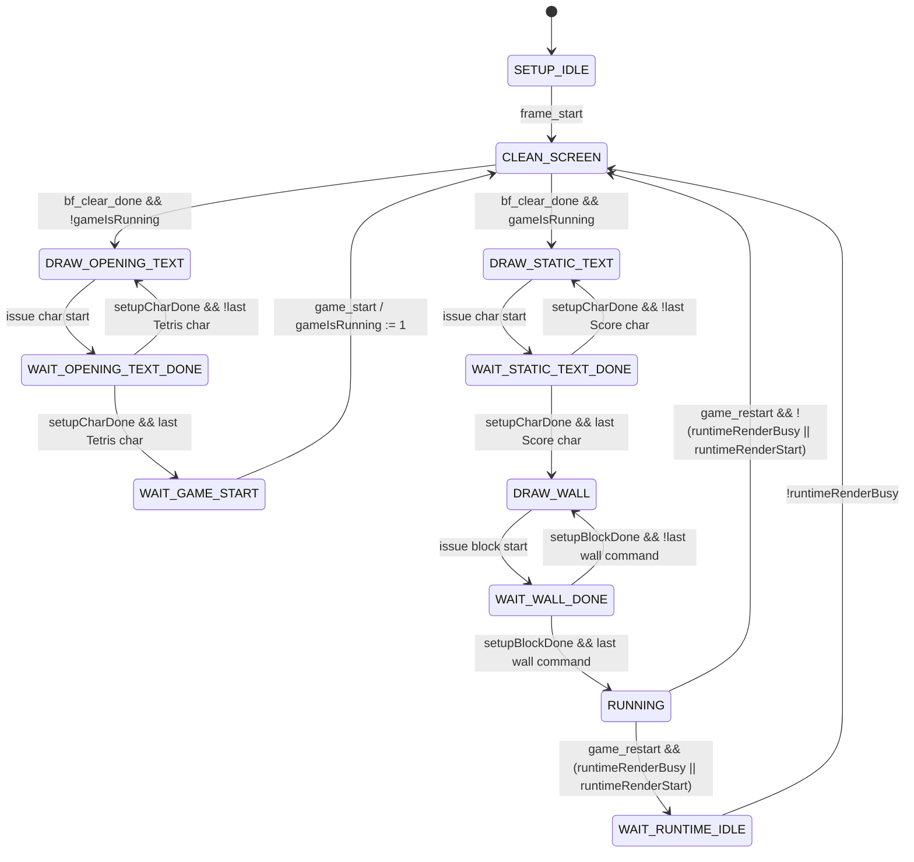
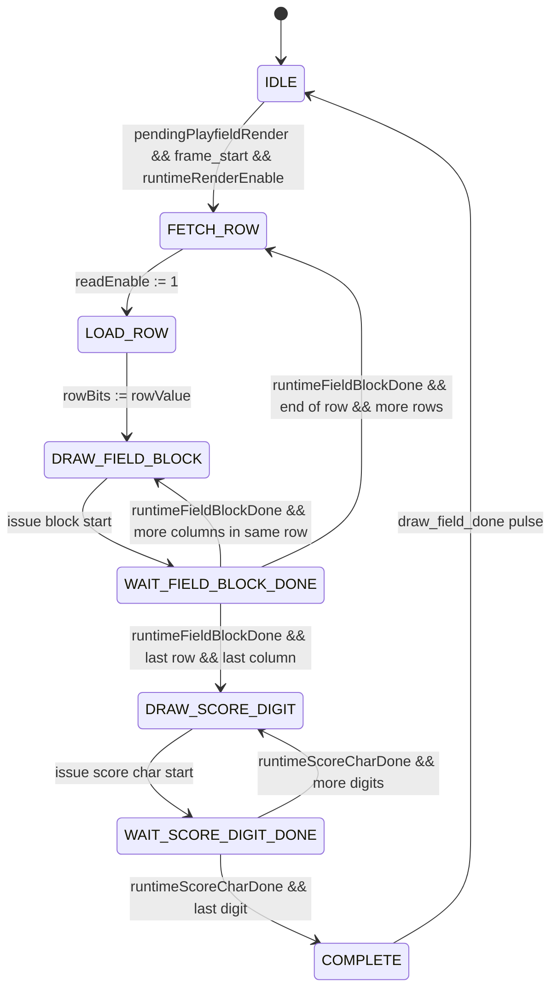

# Display Controller Component Specification

**Component:** `display_controller`  
**Package:** `IPS.display_controller`  
**Specification status:** Integration specification  
**Intended audience:** SoC/display subsystem integrators, verification teams, and implementation review teams  
**Source reference:** `design/IPS/display_controller/src/display_controller.scala`

---

## 1. Purpose and Scope

`display_controller` sequences all high-level drawing requests required by the Tetris display subsystem. It does not draw pixels directly. Instead, it controls external character, block, and frame-buffer-clear engines through pulse-based request/done interfaces.

The controller has two coordinated render paths:

1. **Setup renderer**
   - Clears the screen.
   - Draws the opening `Tetris` banner.
   - Waits for `game_start`.
   - Clears the screen again.
   - Draws the static in-game `Score` label and playfield walls.
   - Asserts `screen_is_ready` while the game is in the running display mode.

2. **Runtime renderer**
   - Captures playfield row bursts through `row_val`.
   - Captures score updates through `score_val` and converts them to BCD digits.
   - Waits for the next `frame_start` while setup is running-ready.
   - Draws every playfield cell, then draws score digits.
   - Pulses `draw_field_done` when one runtime refresh completes.

---

## 2. Configuration Parameters

### 2.1 `DisplayControllerConfig`

| Parameter | Type | Description |
|---|---:|---|
| `IDX_W` | `Int` | Color index width in bits. Default is `4`. |
| `FB_X_ADDRWIDTH` | `Int` | Width of X-origin outputs. For 320-pixel framebuffer, typical value is `log2Up(320) = 9`. |
| `FB_Y_ADDRWIDTH` | `Int` | Width of Y-origin outputs. For 240-pixel framebuffer, typical value is `log2Up(240) = 8`. |
| `bg_color_idx` | `Int` | Background color index used for text erase/background and runtime block pattern color. |
| `playFieldConfig` | `TetrisPlayFeildConfig` | Playfield geometry and piece colors. |
| `scoreBitsWidth` | `Int` | Binary score input width. Default is `10`. |

### 2.2 Global playfield constants

The current project configuration defines:

| Constant | Value | Meaning |
|---|---:|---|
| `rowNum` | `23` | Total rows including bottom wall. |
| `colNum` | `12` | Total columns including left and right walls. |
| `rowBlocksNum` | `22` | Runtime working-field rows. |
| `colBlocksNum` | `10` | Runtime working-field columns. |

The RTL remains parameterized by these constants at elaboration time.

### 2.3 Geometry convention

Block command `width` and `height` are inclusive end counts expected by the downstream block engine. Therefore, a logical block dimension of `N` pixels is emitted as `N - 1`.

Runtime playfield blocks use:

| Field | Value |
|---|---:|
| `width` | `block_len - 2` |
| `height` | `block_len - 2` |
| `fill_pattern` | `BlockFillPattern.SOLID = 0` |
| `pat_color` | `bg_color_idx` |
| occupied-cell `in_color` | `playFieldConfig.piece_ft_color` |
| empty-cell `in_color` | `playFieldConfig.piece_bg_color` |

---

## 3. External Interface Summary

The component uses the parent SpinalHDL clock domain. There is no explicit clock or reset port in this component declaration. Reset behavior described below is the initialized/register-reset state under the parent clock domain.

### 3.1 Top-level ports

| Signal | Direction | Width | Reset / idle value | Description |
|---|---|---:|---|---|
| `game_restart` | Input | 1 | `0` | Pulse request to redraw the in-game static scene and discard stale pending runtime refreshes. |
| `frame_start` | Input | 1 | `0` | One-cycle frame boundary pulse. Starts setup activity from setup idle and starts runtime refresh when a full playfield update is pending. |
| `game_start` | Input | 1 | `0` | One-cycle pulse that exits the opening banner wait state and enters in-game setup. |
| `row_val.valid` | Input | 1 | `0` | Valid qualifier for one playfield row payload. No backpressure is provided. |
| `row_val.payload` | Input | `colBlocksNum` | `0` | One playfield row, MSB rendered as the leftmost field cell. |
| `score_val.valid` | Input | 1 | `0` | Valid qualifier for binary score update. No backpressure is provided. |
| `score_val.payload` | Input | `scoreBitsWidth` | `0` | Binary score value converted internally to BCD. |
| `screen_is_ready` | Output | 1 | `0` | Asserted while static in-game setup has completed and setup FSM is in `RUNNING`. |
| `draw_char.start` | Output | 1 | `0` | One-cycle character draw request pulse. |
| `draw_char.word` | Output | 7 | `0` | ASCII character code for draw request. |
| `draw_char.scale` | Output | 3 | `0` | Character scale field. |
| `draw_char.color` | Output | `IDX_W` | `0` | Character foreground color index. |
| `draw_char.done` | Input | 1 | `0` | One-cycle completion pulse from character draw engine. |
| `draw_block.start` | Output | 1 | `0` | One-cycle block draw request pulse. |
| `draw_block.width` | Output | 8 | `0` | Inclusive block width count. |
| `draw_block.height` | Output | 8 | `0` | Inclusive block height count. |
| `draw_block.in_color` | Output | `IDX_W` | `0` | Primary block color. |
| `draw_block.pat_color` | Output | `IDX_W` | `0` | Pattern/background color. |
| `draw_block.fill_pattern` | Output | 2 | `0` | Fill pattern selector. Runtime solid fill uses `0`. |
| `draw_block.done` | Input | 1 | `0` | One-cycle completion pulse from block draw engine. |
| `draw_x_orig` | Output | `FB_X_ADDRWIDTH` | `0` | X origin shared by active character or block draw command. |
| `draw_y_orig` | Output | `FB_Y_ADDRWIDTH` | `0` | Y origin shared by active character or block draw command. |
| `draw_field_done` | Output | 1 | `0` | One-cycle pulse when runtime playfield plus score refresh is complete. |
| `bf_clear_start` | Output | 1 | `0` | One-cycle frame-buffer clear request pulse. |
| `bf_clear_done` | Input | 1 | `0` | One-cycle completion pulse from frame-buffer clear engine. |

---

## 4. Interface Protocol Specifications

### 4.1 Frame and game-control inputs

| Signal | Protocol |
|---|---|
| `frame_start` | Driven as a pulse, normally one clock cycle. In setup idle it starts the opening clear/draw sequence. In running mode it may start runtime rendering only when a pending playfield burst exists. Holding this signal high can retrigger behavior after FSMs return to eligible states and is not the intended use. |
| `game_start` | Driven as a pulse, normally one clock cycle, only meaningful after the opening banner has completed and setup FSM is waiting for game start. |
| `game_restart` | Driven as a pulse, normally one clock cycle, meaningful in running mode. It clears stale pending playfield render requests and causes a static in-game redraw. |

Ordering constraints:

1. At cold start, assert `frame_start` to build the opening screen.
2. Assert `game_start` after the opening banner has completed.
3. Runtime playfield refreshes are accepted only after `screen_is_ready = 1`.
4. A runtime refresh requires both a completed `row_val` burst and a later `frame_start` pulse.
5. `game_restart` may occur while a runtime render is active; setup waits for runtime idle before clearing/redrawing.

### 4.2 Playfield row input: `row_val`

`row_val` is a SpinalHDL `Flow[Bits]`; there is no `ready` signal and therefore no backpressure.

| Item | Requirement |
|---|---|
| Payload width | `colBlocksNum` bits. Current project value is 10 bits. |
| Burst length | One complete playfield snapshot is a contiguous burst covering the configured working rows. Current project value is `rowBlocksNum = 22` rows. |
| Gaps | Forbidden inside a burst. Once `row_val.valid` rises for a snapshot, it must remain asserted for the complete row sequence. |
| End of burst | The falling edge of `row_val.valid` marks row-burst completion and latches a pending runtime render request. |
| Back-to-back bursts | Not explicitly arbitrated. A new burst before the previous pending render is consumed can overwrite playfield storage. Integrators should provide one burst per intended display refresh. |
| Bit mapping | The stored row is rendered MSB first. The current MSB selects the leftmost runtime field cell, then the row bits are shifted left for each subsequent column. |

Implementation assertion reflected in this specification:

- When `row_val.valid` falls, the internal write counter must indicate the final expected row (`rowBlocksNum - 1`). A falling edge before that point is treated as a protocol violation.

### 4.3 Score input: `score_val`

`score_val` is a SpinalHDL `Flow[UInt]`; there is no `ready` signal.

| Item | Requirement |
|---|---|
| Payload width | `scoreBitsWidth`, default 10 bits. |
| Pulse width | One or more valid cycles are accepted by the internal BCD converter. Test usage drives one valid cycle and waits for conversion to settle before requesting runtime render. |
| Capture timing | Converted BCD is cached when the internal converter output is valid. Runtime score drawing uses the cached BCD digits available at draw time. |
| Display format | Four BCD digits are drawn for the default 10-bit score configuration. Leading zeroes are displayed. |
| Digit encoding | ASCII digits are generated as `0x30 + digit`. |

Integrator recommendation: update `score_val` sufficiently before the `frame_start` that starts a runtime refresh so that the BCD cache is updated before score drawing begins.

### 4.4 Character draw engine interface: `draw_char`

| Signal | Direction from `display_controller` | Idle | Active protocol |
|---|---|---:|---|
| `start` | Output | `0` | Asserted for a single cycle to request drawing one character. |
| `word` | Output | `0` | Valid in the same cycle as `start = 1`; ASCII code. |
| `scale` | Output | `0` | Valid in the same cycle as `start = 1`. |
| `color` | Output | `0` | Valid in the same cycle as `start = 1`. |
| `draw_x_orig` | Output | `0` | Valid in the same cycle as `draw_char.start = 1`. |
| `draw_y_orig` | Output | `0` | Valid in the same cycle as `draw_char.start = 1`. |
| `done` | Input | `0` | Completion pulse from character engine. |

Handshake requirements:

1. `draw_char.start` is a request pulse. The downstream engine shall sample all character command fields in the same cycle.
2. `draw_char.done` shall be a pulse after the request has been accepted and completed.
3. `draw_char.done` must not be asserted in the same cycle as `draw_char.start`; this condition is asserted against in RTL.
4. The controller issues the next character only after observing the prior character `done` pulse.
5. `draw_char.start` and `draw_block.start` are mutually exclusive by construction and assertion.

### 4.5 Block draw engine interface: `draw_block`

| Signal | Direction from `display_controller` | Idle | Active protocol |
|---|---|---:|---|
| `start` | Output | `0` | Asserted for a single cycle to request drawing one rectangular block. |
| `width` | Output | `0` | Valid in the same cycle as `start = 1`; inclusive count. |
| `height` | Output | `0` | Valid in the same cycle as `start = 1`; inclusive count. |
| `in_color` | Output | `0` | Valid in the same cycle as `start = 1`. |
| `pat_color` | Output | `0` | Valid in the same cycle as `start = 1`. |
| `fill_pattern` | Output | `0` | Valid in the same cycle as `start = 1`. |
| `draw_x_orig` | Output | `0` | Valid in the same cycle as `draw_block.start = 1`. |
| `draw_y_orig` | Output | `0` | Valid in the same cycle as `draw_block.start = 1`. |
| `done` | Input | `0` | Completion pulse from block engine. |

Handshake requirements:

1. `draw_block.start` is a request pulse. The downstream engine shall sample all block command fields in the same cycle.
2. `draw_block.done` shall be a pulse after the request has been accepted and completed.
3. The controller issues the next block only after observing the prior block `done` pulse.
4. Setup block commands and runtime block commands must not start in the same cycle; this is asserted in RTL.
5. Any block command is forbidden in the same cycle as any character command; this is asserted in RTL.

### 4.6 Frame-buffer clear interface

| Signal | Direction from `display_controller` | Idle | Active protocol |
|---|---|---:|---|
| `bf_clear_start` | Output | `0` | One-cycle pulse generated on entry to the setup `CLEAN_SCREEN` state. |
| `bf_clear_done` | Input | `0` | Completion pulse from the clear engine. Setup remains in `CLEAN_SCREEN` until this is observed. |

Requirements:

1. The clear engine shall treat `bf_clear_start = 1` as a request to clear the complete frame buffer.
2. `bf_clear_done` may be asserted after any implementation-defined clear latency.
3. Setup text/wall drawing does not begin until `bf_clear_done = 1` is observed.

---

## 5. Internal Block Interface Notes

These short interface contracts document the major internal boundaries that are relevant for verification and maintenance.

### 5.1 Setup renderer to command arbiter

| Item | Specification |
|---|---|
| Character command | `setupRenderer.charCommand` contains `start`, origin, ASCII word, scale, and color. Idle is all zeroes. |
| Block command | `setupRenderer.blockCommand` contains `start`, origin, geometry, colors, and pattern. Idle is all zeroes. |
| Ownership | If setup issues a command, the arbiter selects setup over runtime for that command type. Runtime is enabled only while setup is in `RUNNING`, preventing normal contention. |
| Completion routing | `io.draw_char.done` is returned as `setupCharDone` only when the last selected character owner was setup. `io.draw_block.done` is returned as `setupBlockDone` only when the last selected block owner was setup. |
| Forbidden combinations | Setup char and runtime score char start in the same cycle; setup block and runtime block start in the same cycle; any char and any block start in the same cycle. |

### 5.2 Runtime renderer to command arbiter

| Item | Specification |
|---|---|
| Runtime block command | Emits one command per playfield cell. Idle is all zeroes. |
| Runtime score command | Emits one character command per cached BCD digit after all field cells have completed. Idle is all zeroes. |
| Runtime enable | Runtime rendering can start only when `runtimeRenderEnable = 1`, which is driven by setup `RUNNING`. |
| Runtime busy | `runtimeRenderBusy = 1` during runtime FSM states other than idle and complete pulse handling. Setup restart logic uses this to wait for runtime idle before clearing. |
| Runtime start | `runtimeRenderStart` is pulsed when pending playfield data is consumed at a frame boundary. |

### 5.3 Playfield storage to runtime renderer

| Item | Specification |
|---|---|
| Storage | Distributed memory, depth `rowBlocksNum`, width `colBlocksNum`. |
| Write side | `row_val.valid` writes `row_val.payload` at `writeRowCounter`. |
| Pending request | Falling edge of `row_val.valid` sets `pendingPlayfieldRender = 1` unless restart/clear logic clears it. |
| Read side | Runtime renderer reads rows synchronously using `rowCounter` and an explicit read-enable pulse. |
| Consumption | Runtime renderer clears the pending request when it starts a frame-boundary render. |
| Restart handling | Setup restart and wait-runtime-idle states clear stale pending requests so old playfield data is not replayed. |

### 5.4 Score cache to runtime renderer

| Item | Specification |
|---|---|
| Conversion | Binary score is converted by the internal `bcd` component. |
| Cache | BCD output payload is stored in `scoreReg` when converter output is valid. |
| Digit order | `digits(0)` is the most significant BCD digit. Runtime drawing emits digits from most significant to least significant. |
| ASCII formation | Runtime score command forms `word = 0x30 + digit`. |

---

## 6. Command Arbitration and Forbidden Combinations

The final external draw command is selected from setup and runtime command sources.

Priority and routing:

1. Character path:
   - Setup character command is selected when `setupRenderer.charCommand.start = 1`.
   - Otherwise runtime score character command is selected when `runtimeRenderer.scoreCommand.start = 1`.
2. Block path:
   - Setup block command is selected when `setupRenderer.blockCommand.start = 1`.
   - Otherwise runtime field block command is selected when `runtimeRenderer.blockCommand.start = 1`.
3. Shared origin outputs `draw_x_orig` and `draw_y_orig` carry the active character origin if a character command starts; otherwise they carry the active block origin if a block command starts; otherwise they remain zero.

RTL assertions enforce these forbidden combinations:

| Forbidden condition | Reason |
|---|---|
| Setup character start and runtime score character start in the same cycle | Ambiguous character owner/completion routing. |
| Setup block start and runtime field block start in the same cycle | Ambiguous block owner/completion routing. |
| Any character start and any block start in the same cycle | Shared `draw_x_orig`/`draw_y_orig` cannot represent two commands at once. |
| `draw_char.done` and `draw_char.start` in the same cycle | Completion must correspond to a prior request, not the request currently being issued. |
| `row_val.valid` falling before final expected row | Incomplete playfield snapshot would be rendered. |

---

## 7. Setup Renderer FSM

### 7.1 Setup renderer state diagram

### 7.2 Setup renderer transition table

| State | Outputs/actions while active | Exit condition | Next state |
|---|---|---|---|
| `SETUP_IDLE` | Clears text and wall ROM counters when starting. | `frame_start = 1` | `CLEAN_SCREEN` |
| `CLEAN_SCREEN` | Pulses `bf_clear_start` on state entry. | `bf_clear_done = 1` and `gameIsRunning = 0` | `DRAW_OPENING_TEXT` |
| `CLEAN_SCREEN` | Loads `Score` text metadata when game is already running. | `bf_clear_done = 1` and `gameIsRunning = 1` | `DRAW_STATIC_TEXT` |
| `DRAW_OPENING_TEXT` | Issues one char command for current `Tetris` ROM character. | Unconditional after command issue | `WAIT_OPENING_TEXT_DONE` |
| `WAIT_OPENING_TEXT_DONE` | Waits for character engine completion. | `setupCharDone = 1` and current char is not last `Tetris` char | `DRAW_OPENING_TEXT` after incrementing char counter and X origin |
| `WAIT_OPENING_TEXT_DONE` | Waits for character engine completion. | `setupCharDone = 1` and current char is last `Tetris` char | `WAIT_GAME_START` |
| `WAIT_GAME_START` | Holds opening screen; `screen_is_ready = 0`. | `game_start = 1` | `CLEAN_SCREEN`, with `gameIsRunning := 1` |
| `DRAW_STATIC_TEXT` | Issues one char command for current `Score` ROM character. | Unconditional after command issue | `WAIT_STATIC_TEXT_DONE` |
| `WAIT_STATIC_TEXT_DONE` | Waits for character engine completion. | `setupCharDone = 1` and current char is not last `Score` char | `DRAW_STATIC_TEXT` after incrementing char counter and X origin |
| `WAIT_STATIC_TEXT_DONE` | Waits for character engine completion. | `setupCharDone = 1` and current char is last `Score` char | `DRAW_WALL` |
| `DRAW_WALL` | Issues one block command from wall ROM. | Unconditional after command issue | `WAIT_WALL_DONE` |
| `WAIT_WALL_DONE` | Waits for block engine completion. | `setupBlockDone = 1` and more wall commands remain | `DRAW_WALL` after incrementing wall counter |
| `WAIT_WALL_DONE` | Waits for block engine completion. | `setupBlockDone = 1` and last wall command completed | `RUNNING` |
| `RUNNING` | `runtimeRenderEnable = 1`; `screen_is_ready = 1`. | `game_restart = 1` and runtime is idle/not starting | `CLEAN_SCREEN` |
| `RUNNING` | Clears stale pending playfield request on restart. | `game_restart = 1` and runtime busy or just starting | `WAIT_RUNTIME_IDLE` |
| `WAIT_RUNTIME_IDLE` | Keeps clearing stale pending playfield request. | `runtimeRenderBusy = 0` | `CLEAN_SCREEN` |

### 7.3 Static draw sequence

| Phase | Draw commands |
|---|---|
| Opening screen | Characters `T`, `e`, `t`, `r`, `i`, `s` at configured `Tetris` origin, width step, scale, and color. |
| In-game static text | Characters `S`, `c`, `o`, `r`, `e` at configured `Score` origin, width step, scale, and color. |
| In-game walls | Four block commands: left wall, right wall, base wall, and score separator bar. |

For the default test geometry (`block_len = 9`, `wall_width = 9`, `x_orig = 50`, `y_orig = 20`), expected wall-like setup block commands are:

| Order | X | Y | Width | Height | `in_color` | `pat_color` | `fill_pattern` |
|---:|---:|---:|---:|---:|---:|---:|---:|
| 0 | `x_orig` | `y_orig` | `wall_width - 1` | `wall_height - 1` | 0 | 15 | 3 |
| 1 | `getRightWallOrig._1` | `getRightWallOrig._2` | `wall_width - 1` | `wall_height - 1` | 0 | 15 | 3 |
| 2 | `getBaseOrig._1` | `getBaseOrig._2` | `base_width - 1` | `base_height - 1` | 0 | 15 | 3 |
| 3 | 190 | 10 | 2 | 222 | 15 | 14 | 0 |

---

## 8. Runtime Renderer FSM

### 8.1 Runtime renderer state diagram

### 8.2 Runtime renderer transition table

| State | Outputs/actions while active | Exit condition | Next state |
|---|---|---|---|
| `IDLE` | Counters idle. | `pendingPlayfieldRender = 1`, `frame_start = 1`, and `runtimeRenderEnable = 1` | `FETCH_ROW`; clears row/column/digit counters and initializes draw origins |
| `FETCH_ROW` | `runtimeRenderBusy = 1`; asserts internal memory read enable. | Unconditional | `LOAD_ROW` |
| `LOAD_ROW` | `runtimeRenderBusy = 1`; captures synchronous memory output into `rowBits`. | Unconditional | `DRAW_FIELD_BLOCK` |
| `DRAW_FIELD_BLOCK` | `runtimeRenderBusy = 1`; issues one block command for current row/column. | Unconditional after command issue | `WAIT_FIELD_BLOCK_DONE` |
| `WAIT_FIELD_BLOCK_DONE` | `runtimeRenderBusy = 1`; waits for block engine completion. | `runtimeFieldBlockDone = 1` and more columns remain | `DRAW_FIELD_BLOCK`; increments column, shifts `rowBits` left, increments X origin |
| `WAIT_FIELD_BLOCK_DONE` | Same as above. | `runtimeFieldBlockDone = 1`, end of row, and more rows remain | `FETCH_ROW`; increments row, clears column, resets X origin, increments Y origin |
| `WAIT_FIELD_BLOCK_DONE` | Same as above. | `runtimeFieldBlockDone = 1`, final row and final column | `DRAW_SCORE_DIGIT`; clears digit counter and initializes score X origin |
| `DRAW_SCORE_DIGIT` | `runtimeRenderBusy = 1`; issues one character command for current cached BCD digit. | Unconditional after command issue | `WAIT_SCORE_DIGIT_DONE` |
| `WAIT_SCORE_DIGIT_DONE` | `runtimeRenderBusy = 1`; waits for character engine completion. | `runtimeScoreCharDone = 1` and more digits remain | `DRAW_SCORE_DIGIT`; increments digit counter and score X origin |
| `WAIT_SCORE_DIGIT_DONE` | Same as above. | `runtimeScoreCharDone = 1` and final digit completed | `COMPLETE` |
| `COMPLETE` | Pulses `draw_field_done = 1`. | Unconditional | `IDLE` |

### 8.3 Runtime draw order

For one runtime refresh, the controller emits commands in the following order:

1. Playfield cell block commands in row-major order.
2. Within each row, cells are drawn left-to-right using MSB-first row payload mapping.
3. Score digit character commands from most significant to least significant cached BCD digit.
4. `draw_field_done` pulses after the final score digit completion.

With current project constants, one runtime refresh emits:

| Command type | Count |
|---|---:|
| Runtime field block commands | `rowBlocksNum * colBlocksNum = 22 * 10 = 220` |
| Runtime score character commands | BCD digit count from score converter; default 10-bit score produces 4 digits |
| `draw_field_done` pulse | 1 |

---

## 9. Reset and Idle Behavior

After reset/initialization:

| Register / output | Initial value / behavior |
|---|---|
| `screen_is_ready` | `0` |
| `draw_field_done` | `0` |
| `bf_clear_start` | `0` |
| Selected draw command fields | Zero unless a command source starts. |
| `pendingPlayfieldRender` | `0` |
| Runtime counters | Cleared before starting a runtime refresh. |
| Runtime origin registers | Set to configured field/score origins when runtime refresh starts. |
| Setup `gameIsRunning` | `0`, so first setup clear proceeds to opening `Tetris` text. |
| Score cache | BCD register initialized to `0`, so displayed score defaults to leading-zero decimal zero until updated. |

---

## 10. Input Constraints and Integration Requirements

The following constraints are required for correct integration:

1. **No broken playfield bursts**  
   `row_val.valid` shall remain continuously asserted for the complete playfield row sequence. Deasserting early violates the asserted row-burst contract.

2. **No reliance on backpressure**  
   `row_val` and `score_val` are `Flow` interfaces. The controller cannot stall senders. The upstream producer must schedule updates safely.

3. **Frame boundary gating**  
   A playfield burst does not render immediately. It becomes pending and is consumed at a later `frame_start` only when setup is in `RUNNING`.

4. **Draw engine done pulses**  
   `draw_char.done`, `draw_block.done`, and `bf_clear_done` shall be pulse-like completion events. Holding a done signal high across unrelated requests can cause unintended immediate completion of later FSM states.

5. **Character done/start exclusion**  
   The character engine shall not assert `draw_char.done` in the same cycle that `draw_char.start` is asserted.

6. **Score update timing**  
   The binary-to-BCD conversion is not specified as combinational at the top-level interface. Update `score_val` before the frame that must display the new score, and allow converter latency before runtime score drawing.

7. **Restart semantics**  
   `game_restart` discards stale pending playfield renders. After restart, a new `row_val` burst is required before a subsequent `frame_start` can produce runtime playfield rendering.

8. **Single active drawing resource**  
   The external display subsystem must support one draw command at a time because character and block commands share origin outputs. The controller enforces one active command type per start cycle.

---

## 11. Verification Intent and Observed Test Scenarios

The existing component tests verify the following externally visible behavior:

| Scenario | Verified behavior |
|---|---|
| Opening frame | `frame_start` triggers clear, then draws exactly `Tetris`, then waits for `game_start`; no wall/runtime blocks are drawn; `screen_is_ready = 0`. |
| Game start | `game_start` triggers clear, draws `Score`, draws four static wall/separator blocks, then asserts `screen_is_ready`. |
| Runtime refresh | Score and playfield data are accepted before `frame_start`; no runtime commands are emitted until `frame_start`; then all field cells are drawn followed by score digits and `draw_field_done`. |
| Restart | A pending stale runtime refresh is dropped; static in-game scene is redrawn; an immediate `frame_start` does not replay old playfield data; a fresh burst plus later `frame_start` renders normally. |

---

## 12. Customer Integration Checklist

Before connecting `display_controller` into a display subsystem, verify:

- [ ] `FB_X_ADDRWIDTH` and `FB_Y_ADDRWIDTH` cover all configured origins and block extents.
- [ ] `IDX_W` covers all configured color indices.
- [ ] The frame-buffer clear engine responds to `bf_clear_start` with a clean `bf_clear_done` pulse.
- [ ] Character and block engines sample command payloads in the same cycle as `start`.
- [ ] Character and block engines return pulse-style `done` only after completing the corresponding command.
- [ ] Upstream playfield producer sends contiguous full-row bursts without gaps.
- [ ] Upstream score producer updates early enough for BCD conversion before runtime score drawing.
- [ ] System-level verification covers restart while runtime render is idle, busy, and at frame-start boundary.
- [ ] System-level verification covers maximum score value representable by `scoreBitsWidth`.

---

## 13. Revision History

| Revision | Date | Description |
|---|---|---|
| 0.1 | 2026-05-23 | Initial customer-facing specification drafted from SpinalHDL source and component tests. |

